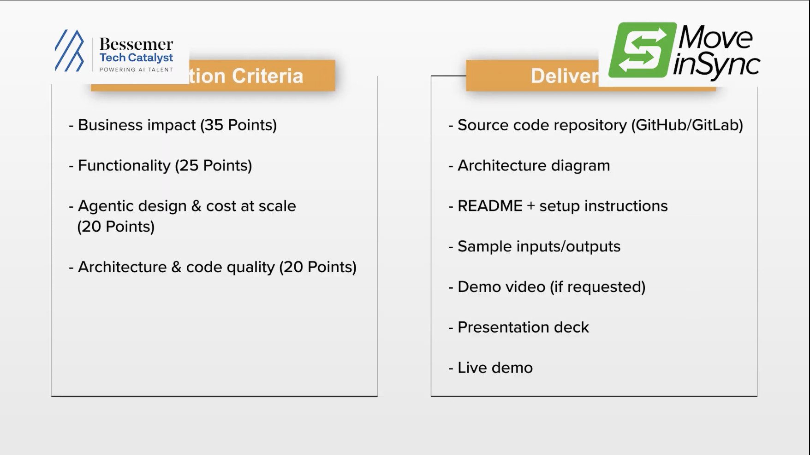

# Team: Sudo
# MoveInSync - Agentic Intelligence for Enterprise Mobility

> **Reimagining how enterprises manage employee transportation at scale.**

Building intelligent agents that **SENSE**, **REASON**, and **ACT** to transform enterprise employee mobility operations.

---

## 🌍 About MoveInSync

**MoveInSync** is the world's largest office, commute, and workplace management platform. We manage the complete employee journey from doorstep to office to home.

### Our Scale
- **1M+ employees** managed daily
- **400+ organizations** served
- **120+ Fortune 500 companies** as clients
- **24/7 live data streams** across all dimensions

---

## 🎯 The Challenge

### The Problem

Every day, MoveInSync processes massive amounts of transportation and mobility data covering:
- **Timeliness** - Are employees arriving on schedule?
- **Safety** - Are journeys secure and incident-free?
- **Cost** - What is the transportation ROI?
- **Vendor Performance** - How are logistics partners performing?
- **Carbon Emissions** - What is our environmental impact?

However, **live data streams 24/7**, and traditional dashboards cannot keep pace with the volume and velocity. Decision-makers need intelligence, not just data.

### The Solution Challenge

**Build an agentic layer that can:**

1. **🔍 SENSE** - Understand what is happening in real-time transportation data
2. **🧠 REASON** - Determine why events are occurring and what they mean  
3. **⚡ ACT** - Take autonomous or guided actions to optimize outcomes

All with **minimal human prompting or interaction**.

---

## 👥 Target Personas

Your solution must serve one or more of these three personas:

### 1. 🚕 Transport Manager
**Real-time operational control and tactical optimization**
- Monitor route on-time performance and SLA compliance
- Get immediate alerts for delays and incidents
- Optimize routes and vendor allocation in real-time
- Daily tactical decision-making

### 2. 👔 Line Manager  
**Team-level insights and compliance**
- Track team member commute patterns
- Correlate commute issues with attendance
- Monitor team transportation costs
- Ensure safety and compliance reporting

### 3. 🎯 Transport Head
**Strategic insights and leadership reporting**
- Analyze monthly/quarterly trends and KPIs
- Evaluate vendor performance and partnerships
- Track sustainability and carbon footprint goals
- Make long-term strategic decisions

---

## 📋 Requirements Framework

### 🔴 MANDATORY Requirements (All 4 Required)

1. ✅ **Runs on Sample Dataset** - Works with provided or generated transportation data
2. ✅ **Sense → Reason → Act** - Demonstrates the complete agent decision-making flow
3. ✅ **Serves One Persona** - Tailored insights and actions for transport manager, line manager, or transport head
4. ✅ **Context-Rich Metrics** - Every metric includes business impact, trend, and urgency

### 🟡 GOOD-TO-HAVE Features

- Handles messy/incomplete data gracefully
- Triggers actions autonomously without prompting
- Generates leadership-ready reports without manual editing

### 🎁 BONUS Features

- Multi-persona support
- Real-time data streaming
- Predictive analytics
- Natural language interaction
- Mobile-friendly interfaces
- Enterprise system integration

---

## 🛠️ Tech Stack

### Preferred Stack (Not Required)
- **Backend:** Java
- **Frontend:** Angular  
- **Infrastructure:** AWS

### Use Any Stack
Pick what you're comfortable with. Focus on solving the problem, not technology choice.

---

## 📊 Key Data Domains

Your agent should reason across these dimensions:

- **Timeliness** - On-time performance, delays, adherence
- **Safety** - Incident tracking, risk zones, driver ratings
- **Cost** - Per-route, per-employee, trend analysis
- **Vendor Performance** - SLA compliance, quality metrics, reliability
- **Sustainability** - Carbon footprint, emissions trends, green optimization

---

## 🤖 Agent Design Framework

Your agent should follow this architecture pattern:

### Sense Layer
```
Transportation Data → Data Aggregation → Pattern Detection
```
- Ingest live and historical transportation data
- Normalize and validate data quality
- Detect anomalies, patterns, and significant events

### Reason Layer  
```
Patterns → Root Cause Analysis → Business Impact Assessment
```
- Analyze why events are occurring
- Correlate multiple data sources
- Quantify business impact (cost, safety, compliance, efficiency)
- Generate context and narrative for insights

### Act Layer
```
Insights → Decision Logic → Actions/Recommendations
```
- Recommend specific actions based on reasoning
- Trigger alerts for critical situations
- Propose operational changes (route optimization, vendor changes, etc.)
- Generate persona-specific reports and visualizations

### Recommended Folder Structure
```
src/agents/
├── sensor/
│   ├── data-collector.js      # Ingest data
│   ├── data-validator.js      # Quality checks
│   └── pattern-detector.js    # Find signals
├── reasoner/
│   ├── analyzer.js            # Root cause analysis
│   ├── impact-calculator.js   # Quantify business impact
│   └── context-builder.js     # Build narratives
├── actor/
│   ├── decision-engine.js     # Decision logic
│   ├── action-trigger.js      # Trigger actions
│   └── report-generator.js    # Generate outputs
└── orchestrator.js            # Coordinate sense→reason→act
```

---

## 📸 Visual Reference

### Judging Criteria


### Solution Forms


---

## 📚 Detailed Resources

- **[Full Problem Statement](docs/PROBLEM_STATEMENT.md)** - Complete requirements, personas, and success criteria
- **[Problem Explanation Video](https://drive.google.com/file/d/1B7nLPnQuZwYTr6PoTwAd_5PAcJCsFz-l/view)** - Watch Udual Trii (VP Product) explain the challenge
- **[Use Case Document](https://hackcultureplatform.blob.core.windows.net/event-assets/hackathons/6a429905623dd6dbd3249f0e/problem_explanation_7qdzf3jxklt.pdf)** - Detailed use case and examples
- **[Architecture Guide](docs/ARCHITECTURE.md)** - Technical architecture and component design

---

## 🏗️ Solution Architecture

The solution is built on agentic AI principles with the following components:

- **Intelligence Layer** - Autonomous agents for data analysis and decision-making
- **Reporting Engine** - Real-time and scheduled report generation
- **Integration Hub** - Connect with existing enterprise systems
- **Analytics Dashboard** - Visualization of key metrics and insights

## 🏗️ Architecture

The solution is built on agentic AI principles with the following components:

- **Intelligence Layer** - Autonomous agents for data analysis and decision-making
- **Reporting Engine** - Real-time and scheduled report generation
- **Integration Hub** - Connect with existing enterprise systems
- **Analytics Dashboard** - Visualization of key metrics and insights

## 🚀 Getting Started

### Prerequisites

- Git
- Your preferred language runtime (Node.js, Python, Java, etc.)
- IDE or code editor

### Quick Start

```bash
# Clone the repository
git clone https://github.com/vishnuverse/moveinsync-agentic-intelligence.git
cd moveinsync-agentic-intelligence

# Review the challenge
cat docs/PROBLEM_STATEMENT.md

# Watch the problem explanation
# Visit: https://drive.google.com/file/d/1B7nLPnQuZwYTr6PoTwAd_5PAcJCsFz-l/view

# Start building your agent
# Implement in src/agents/ directory
```

### Running the Full Stack (Docker)

```bash
docker compose up --build
```

This boots postgres, redis, the backend/scheduler, and the frontend — the
full app, at **http://localhost:5173**, no Cloudflare account or any other
external service needed. The app works out of the box on generated synthetic
data; no dataset download is required to run it.

#### Optional: real dataset

To run against the real (anonymised) MoveInSync dataset described in
[`data/Dictionary/README.md`](data/Dictionary/README.md) instead of synthetic
data:

1. Download the dataset from
   [this Google Drive folder](https://drive.google.com/drive/folders/1RXRWwqeoai6rNbzMp8W4ZMIcWT_u1VGj)
   (**not included in this repo**: at ~670MB total, with one file over
   GitHub's 100MB per-file limit, it can't be committed).
2. Place the CSVs directly in `data/` at the repo root (gitignored — they
   stay local, never get committed):
   ```
   data/
   ├── Ride_data _trip-may_2026.csv
   ├── Ride_data _trip-June_2026.csv
   ├── Ride_data _trip-July_2026.csv
   ├── emp_Data.csv
   ├── bill_data.csv
   ├── alerts_data.csv
   └── trip_feedback.csv
   ```
3. Run `docker compose up --build`. The `seed` service ingests real data
   automatically **the first time** it finds these files with an empty
   database. On every later `docker compose up` (restart, code change, etc.)
   it skips re-ingesting since the data's already there — so this is a
   one-time step, not something that reruns on every boot. To force a full
   re-ingest, drop the postgres volume first: `docker compose down -v`.

#### Optional: public URL via Cloudflare Tunnel

Not needed to run or evaluate the app — `docker compose up` alone already
serves the full stack at `http://localhost:5173`. This is only for sharing
a stable public URL (e.g. for a remote demo) instead of `localhost`.

The `cloudflared` service in [`docker-compose.yml`](docker-compose.yml) is
gated behind a Compose profile and skipped by a plain `docker compose up`,
since it needs a tunnel credentials file that only whoever owns that
Cloudflare tunnel has (gitignored — see `.gitignore` — and never committed).
To set up and run your own:

1. Install `cloudflared` and authenticate with your own Cloudflare account —
   see the official
   [Cloudflare Tunnel documentation](https://developers.cloudflare.com/cloudflare-one/connections/connect-networks/)
   for install instructions per OS and `cloudflared tunnel login`.
2. Create a named tunnel and route a hostname you control to it:
   ```bash
   cloudflared tunnel create <your-tunnel-name>
   cloudflared tunnel route dns <your-tunnel-name> <your-hostname>
   ```
   This generates a credentials JSON (`cloudflared tunnel create` prints
   where it's saved) and a tunnel ID.
3. Replace the placeholder `tunnel:`/`credentials-file:` values and
   `hostname:` in [`cloudflared/config.yml`](cloudflared/config.yml) with
   your own tunnel ID and hostname, and copy your credentials JSON into
   `cloudflared/` (same directory, gitignored — it'll sit alongside
   `config.yml` as `<your-tunnel-id>.json`).
4. Start the full stack with the tunnel included:
   ```bash
   docker compose --profile tunnel up --build
   ```
   If you run this often, you don't have to type `--profile tunnel` every
   time: Compose also reads the
   [`COMPOSE_PROFILES`](https://docs.docker.com/compose/environment-variables/envvars/#compose_profiles)
   environment variable, including from a `.env` file in the repo root
   (already gitignored — see `.gitignore` — so it stays local to your
   machine). Create one with:
   ```bash
   echo "COMPOSE_PROFILES=tunnel" >> .env
   ```
   and from then on, plain `docker compose up --build` includes
   `cloudflared` on this machine, same as before this became opt-in —
   without changing what anyone else's `docker compose up` does.

### Development Workflow

1. **Choose your persona** - Transport manager, line manager, or transport head
2. **Design your agent** - Plan sense → reason → act flow
3. **Implement using your stack** - Java, Node.js, Python, or your choice
4. **Create sample data** - Generate or use provided transportation data
5. **Test and iterate** - Validate against all mandatory requirements
6. **Document and demo** - Prepare clear explanation of your solution

## 📦 Project Structure

```
moveinsync-agentic-intelligence/
├── README.md                    # Main documentation
├── src/
│   ├── agents/                  # Your agent implementation
│   │   ├── sensor/              # Data ingestion & pattern detection
│   │   ├── reasoner/            # Analysis & impact assessment
│   │   ├── actor/               # Action triggering & reporting
│   │   └── orchestrator.js      # Coordinate sense→reason→act
│   ├── api/                     # API endpoints
│   ├── services/                # Core services
│   └── utils/                   # Utilities
├── docs/
│   ├── PROBLEM_STATEMENT.md     # Complete requirements & personas
│   ├── ARCHITECTURE.md          # Technical architecture
│   ├── judging_criteria.png     # Judging framework
│   └── solution_forms.png       # Solution approaches
├── tests/                       # Test suite
└── sample-data/                 # Sample transportation data (create as needed)
```

## 🛠️ Tech Stack Options

### Preferred Stack (Recommended but not Required)
- **Backend:** Java with Spring Boot
- **Frontend:** Angular
- **Infrastructure:** AWS (Lambda, RDS, S3)
- **AI/ML:** Claude API for reasoning layer

### Fully Flexible
Use Node.js, Python, Go, C#, or any technology you prefer. The focus is on solving the challenge, not the stack.

## 📊 Sample Data

Create a `sample-data/` directory with example transportation data:

```json
{
  "routes": [
    {
      "id": "route-001",
      "name": "Downtown Route A",
      "distance_km": 25.5,
      "scheduled_duration_min": 45,
      "scheduled_departure": "2026-09-04T08:00:00Z",
      "actual_departure": "2026-09-04T08:05:00Z",
      "scheduled_arrival": "2026-09-04T08:45:00Z",
      "actual_arrival": "2026-09-04T08:58:00Z"
    }
  ],
  "metrics": {
    "timeliness_score": 0.92,
    "safety_incidents": 0,
    "cost_per_employee": 12.50,
    "carbon_emissions_kg": 145.2
  }
}
```

## ✅ Success Checklist

Before submitting your solution, ensure:

- [ ] Solution runs on sample transportation data
- [ ] Agent demonstrates SENSE → REASON → ACT flow
- [ ] Solution targets one persona (transport manager, line manager, or transport head)
- [ ] Every metric includes context (business impact, trend, urgency)
- [ ] Code is clean, documented, and maintainable
- [ ] README includes clear instructions to run the solution
- [ ] You can explain your agent's reasoning in 5 minutes

## 🎯 Evaluation Criteria

Solutions will be judged on:

1. **Does It Work?** - Runs without errors, meets all mandatory requirements
2. **Does It Land?** - Provides genuine value to target persona, insights are actionable
3. **Can It Scale?** - Architecture supports enterprise scale, code is maintainable

## 📚 Example Agent Scenarios

### Transport Manager's Morning Brief
1. **SENSE:** Analyze overnight scheduling, weather, historical patterns
2. **REASON:** Identify high-delay-risk routes; flag vendor issues
3. **ACT:** Send dispatch alerts, suggest backup vendors, optimize routes

### Line Manager's Weekly Report
1. **SENSE:** Aggregate team commute data and attendance patterns
2. **REASON:** Correlate commute issues with absences; spot cost outliers
3. **ACT:** Flag compliance issues, suggest improvements, track trends

### Transport Head's Monthly Strategy
1. **SENSE:** Aggregate performance across all routes, vendors, regions
2. **REASON:** Identify strategic trends, vendor performance, ROI
3. **ACT:** Generate executive summary, recommend policy changes, suggest partnerships

---

## 🤝 Contributing

Contributions are welcome! Please follow the development guidelines in [CONTRIBUTING.md](CONTRIBUTING.md).

## 📄 License

This project is licensed under the MIT License - see [LICENSE](LICENSE) file for details.

## 📞 Questions & Support

### For Hackathon Participants
- Review [PROBLEM_STATEMENT.md](docs/PROBLEM_STATEMENT.md) for detailed requirements
- Watch the [problem explanation video](https://drive.google.com/file/d/1B7nLPnQuZwYTr6PoTwAd_5PAcJCsFz-l/view)
- Check the [use case document](https://hackcultureplatform.blob.core.windows.net/event-assets/hackathons/6a429905623dd6dbd3249f0e/problem_explanation_7qdzf3jxklt.pdf)
- Open an issue if you have questions

---

## 🚀 Let's Build Agents That Can Act!

This is your chance to build intelligent automation that transforms enterprise operations. The challenge is open-ended by design—bring your creativity, focus on the user, and build something that actually works.

**Remember:**
- Start simple, iterate fast
- Focus on the persona, not the technology
- Every decision should be defensible
- Clean code beats clever code
- Document your reasoning

Good luck! 🎉

---

**Hackathon Theme:** Agentic AI  
**Domain:** Enterprise Mobility / Operations Intelligence  
**Last Updated:** September 4, 2026
