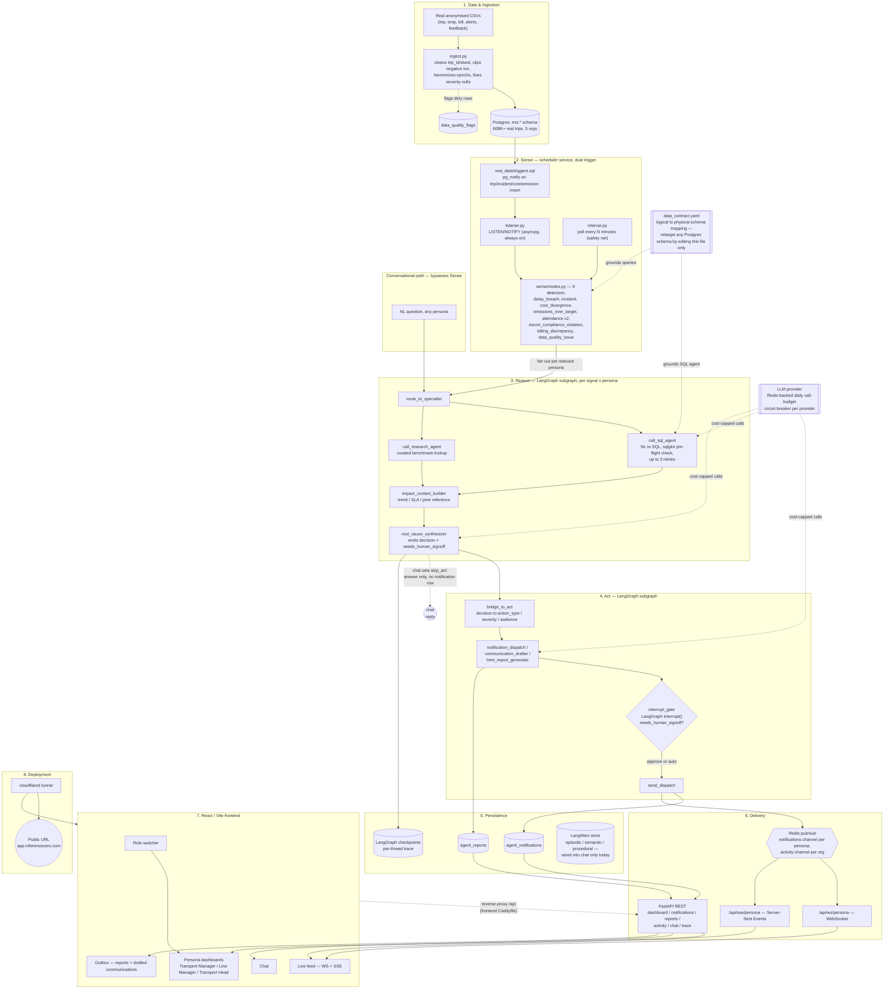

# MoveInSync-AIR — Technical Architecture

This describes the system as actually built and running, not an aspirational
sketch. Every component named below has a corresponding file path — follow
the links to the real code rather than trusting this document blindly as
things evolve; see [BACKLOG.md](BACKLOG.md) for what's built vs. still open.

## High-level architecture

## Component details

### 1. Data & Ingestion
- Source: the anonymised MoveInSync sample dataset (`ride_data_trip`, `emp_data`,
  `bill_data`, `alerts_data`, `trip_feedback`) — see
  [`data/Dictionary/`](../data/Dictionary/) for field definitions.
- `backend/db/real_data/ingest.py` loads the CSVs into the real `mis.*`
  Postgres schema (`backend/db/real_data/mis_schema.sql`), applying the messy-data
  fixes named in the PRD: `trip_id`/`stwid` comma-and-type coercion, negative
  `planned_km`/`traveled_km` clipped to 0 and flagged, epoch/timestamp
  harmonization, and `alerts_data.severity`'s stray `"False"` string coerced to
  null.
- Rows that needed a fix are recorded in `data_quality_flags`, not silently
  dropped — this is the "handles messy data gracefully" good-to-have made
  concrete and auditable.

### 2. Sense
- Two independent, always-on trigger paths run in the `scheduler` service
  (`backend/app/schedulers/main.py`), both landing on the same detector code:
  - **Event-driven:** `real_data/triggers.sql` fires `pg_notify` on insert into
    the real fact tables; `app/graph/sense/listener.py` holds a dedicated
    `asyncpg` LISTEN connection and streams events to
    `app/schedulers/listener_bridge.py`.
  - **Interval poll:** `app/schedulers/interval.py` re-runs the same detection
    sweep on a fixed cadence, as a safety net if an event is ever missed.
- `app/graph/sense/nodes.py` holds 9 independent detectors, each emitting a
  typed `Signal`: `delay_breach`, `incident`, `cost_divergence`,
  `emissions_over_target`, `attendance_correlated_with_transport`,
  `attendance_unrelated_late`, `escort_compliance_violation`,
  `billing_discrepancy`, `data_quality_issue`.
- Every detector query is written against **logical** entity/column names
  resolved through `backend/config/data_contract.yaml` — not hardcoded table
  names — so pointing the whole system at a different production schema is a
  one-file change (`DATA_CONTRACT_PATH` env var), not a code change.

### 3. Reason
- `app/graph/reason/subgraph.py`: a genuine LangGraph subgraph, not a
  monolithic prompt. `route_to_specialist` sends a signal/question to either
  the **SQL agent** (`app/graph/reason/sql_agent/`: `list_tables` → `get_schema`
  → `generate_query` → `sqlglot` local syntax pre-flight → `run_query` → retry
  loop, max 3 attempts) or the **research agent** (`research_agent/lookup.py`,
  a curated benchmark lookup — not live web/API search, which is an honest
  scope boundary worth stating explicitly rather than implying more).
- `impact_context_builder` (`impact_context.py`) attaches the reference point
  every card is required to carry (trend direction, SLA/goal, severity band).
- `root_cause_synthesizer` (`root_cause.py`) produces the final `decision`
  object, including the `needs_human_signoff` flag that gates the Act layer.

### 4. Act
- `app/graph/act/subgraph.py` routes a decision to one of
  `notification_dispatch`, `communication_drafter` (vendor/leadership
  communications), or `html_report_generator` (`html_report_agent/`, headless
  narrative + chart rendering for leadership-ready reports).
- `interrupt_gate` (`act/nodes.py`) is a real LangGraph `interrupt()` /
  `Command(resume=...)` human-in-the-loop pause — not a hand-rolled boolean
  flag — so a paused action survives process restarts and can't be
  double-sent on repeated approval clicks.
- `send_dispatch` performs the (simulated, in-app) send once approved or
  once the flow determines no sign-off was required.

### 5. Persistence
- `agent_notifications` / `agent_reports`: the operational output tables the
  API layer reads from.
- LangGraph checkpoints: every signal/question run gets its own `thread_id`,
  giving each decision a fully replayable reasoning trace (`GET
  /threads/{id}/trace`, rendered in the frontend's Trace Drawer).
- LangMem store (`app/memory/`): episodic/semantic/procedural memory modules
  exist and are functional, but are currently wired into the **chat** path
  only (`app/api/chat.py`, `app/services/chat_threads.py`) — not yet injected
  into the autonomous reason/act decision path. Documented here as a known,
  tracked gap rather than left implicit.

### 6. Delivery
- `app/graph/act/redis_publish.py` publishes every dispatched action to a
  per-persona notifications channel and a per-org activity channel over Redis
  pub/sub.
- `app/api/ws.py` and `app/api/sse.py` both subscribe to the same channels —
  WebSocket for the live event feed, SSE for notifications/activity streams —
  so the frontend never polls for live state.
- `app/api/*` (dashboard, notifications, reports, activity, chat, trace,
  roles, meta, charts, demo) is the REST surface everything else reads
  through.

### 7. Frontend
- React + Vite, role-switchable in the top nav: **Transport Manager**,
  **Line Manager**, **Transport & Facilities Head** dashboards
  (`frontend/src/dashboards/`) share one backend and one dataset, re-scoped by
  persona — not three separate apps.
- `LivePage`/`LiveEventFeed` renders the WS/SSE stream with a freshness
  heartbeat and an autonomy badge (auto-resolved vs. needs-approval).
- `OutboxPage` surfaces the agent's drafted communications and generated
  reports as an in-app "what the agent would send" view.

### 8. Deployment
- `docker-compose.yml` runs `postgres`, `redis`, `seed` (one-time real-data
  ingest), `backend`, `scheduler`, `frontend` (Vite build served behind
  Caddy, which reverse-proxies `/api` — including the `/api/ws` WebSocket
  upgrade — to `backend`), and `cloudflared` (a named Cloudflare Tunnel
  pointed only at `frontend`, so one tunnel target reaches the whole app).
- The tunnel exposes the running system at **https://app.inferencezero.com**
  — the "Live demo" deliverable, running against the same anonymised sample
  dataset as local development (no live third-party system access, per the
  problem statement's constraint).

## Technology stack

| Layer | Technology |
|---|---|
| Backend | Python, FastAPI |
| Agent orchestration | LangGraph (StateGraph, `interrupt()`/`Command(resume=...)`, per-thread checkpoints) |
| Agent memory | LangMem (episodic/semantic/procedural) |
| LLM | Sarvam (configurable via `LLM_PROVIDER`/`LLM_MODEL`), OpenRouter as an optional fallback |
| Database | PostgreSQL (`pgvector` image), real `mis.*` schema |
| Cache / pub-sub / rate-limit | Redis (event delivery + LLM daily-call-budget circuit breaker) |
| SQL safety | `sqlglot` local syntax pre-flight before executing any agent-generated query |
| Frontend | React, Vite, TypeScript |
| Reverse proxy | Caddy (frontend container) |
| Public exposure | Cloudflare Tunnel (`cloudflared`) |
| Orchestration / local deploy | Docker Compose |

## Data flow (per signal)

1. A real dataset row lands in `mis.trip` (or `incident`/`cost`/`emission`) —
   either via the `seed` job at boot, or via `replay.py` re-inserting a real
   historical row with a fresh timestamp for the live demo.
2. A Postgres trigger fires `pg_notify`; `listener.py` picks it up in
   milliseconds. (`interval.py` independently re-sweeps on a fixed cadence as
   a backstop.)
3. `app.graph.supervisor.run_pipeline` runs the sense detectors, producing zero
   or more typed `Signal`s, each fanned out to the persona(s) it's relevant to.
4. For each (signal, persona) pair, `app.graph.graph.build_top_graph` runs
   `reason → bridge_to_act → act` as one compiled LangGraph, checkpointed under
   its own `thread_id`.
5. `act` either dispatches immediately or pauses at `interrupt_gate` for human
   approval, then publishes the outcome to Redis.
6. The frontend, already subscribed over WebSocket/SSE, updates in place —
   no refresh, no polling.

A natural-language question follows the same `reason` subgraph but sets
`skip_act=True` before the graph reaches `act` — it never writes a
notification row and can never trigger the human-approval gate, keeping
chat side-effect-free by construction (`app/graph/graph.py`'s
`_route_after_reason`).

## Cost & scale notes (criterion: "inference cost per interaction, latency, efficiency at enterprise volumes")

- Every LLM call passes through a Redis-backed daily call-budget circuit
  breaker (`app/llm/provider.py`) — calls are metered and capped per provider,
  failing fast (`LLMBudgetExhaustedError`) rather than looping or degrading
  silently under load.
- The SQL agent validates generated SQL locally with `sqlglot` before ever
  reaching Postgres, avoiding a wasted round-trip (and a wasted retry-driven
  LLM call) on syntactically broken queries.
- Multi-tenancy is structurally present (every table and query is `org_id`-
  scoped, and `data_contract.yaml` is schema-swappable in one file) but not
  yet load-tested across multiple concurrent orgs, and per-signal detection
  cadence/thresholds are still hardcoded constants rather than per-org config
  — both tracked as open items in [BACKLOG.md](BACKLOG.md) rather than
  claimed as finished here.

## Known gaps

This document intentionally does not claim more than what's built. For the
current, actively-maintained list of what's built vs. designed-but-not-built
vs. explicitly out of scope, see [BACKLOG.md](BACKLOG.md).
